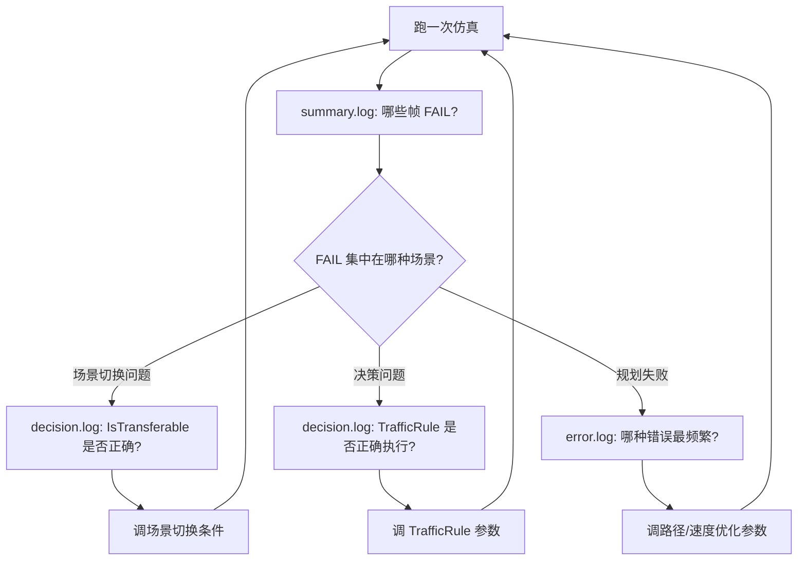

# Apollo PnC 新日志系统 (planlog)

> Phase 1+2+3 实施完成 | 2026-06-17
> 设计文档：`output/log_system_redesign.md`

---

## 一、系统概览

### 架构

```
glog (AINFO/AERROR/...) → PlanningLogSink::send()
  → tag 检测 ([SUMMARY]/[DECISION]/[STATE]/[scn:]/[stg:]/[frm:])
  → thread_local PlanningLogContext 注入 (frame_seq/scenario_name/stage_name)
  → JSON 序列化 (EscapeJsonString + ExtractDatFields)
  → RouteMessage() 按 tag+level 路由到 5 类 writer
```

### 改了什么（2026-06-17 最终状态）

#### 新建文件（6 个）

| 文件 | 用途 |
|------|------|
| `modules/planning/planning_base/common/planlog.h` | 7 个日志宏 |
| `modules/planning/planning_base/common/planlog_context.h/.cc` | `thread_local` 上下文 + `Snapshot` 跨线程传播 |
| `modules/planning/planning_base/common/planlog_sink.h/.cc` | 自定义 `google::LogSink`：JSON 序列化 + 路由 |
| `modules/planning/planning_base/common/planlog_init.cc` | 初始化 + 启动日志轮转（>100MB 自动 rotate） |
| `scripts/clean_logs.sh` | 一键清理（7 种策略） |
| `scripts/planlog.sh` | grep/awk 过滤工具（v0.1） |

#### 修改文件（13 个 + Phase 3 增强）

| 文件 | 变更要点 |
|------|------|
| `planning_gflags.cc/.h` | 5 个 gflags；`planning_log_dir` 默认绝对路径 |
| `planning_base/BUILD` | srcs/hdrs 添加全部 planlog 文件 |
| `planning_component.cc/.h` | Init/析构中调用 `Init/ShutdownLogger()` |
| `on_lane_planning.cc` | `set_frame_seq` 移到帧最开头；帧结束写 **~40 字段** `PFRAME_SUMMARY` |
| `scenario_manager.cc` | 所有场景路径设 `scenario_name` + `IsTransferable` TRUE/FALSE 均记录 |
| `public_road_planner.cc` | `Plan()` 入口/出口 + Process 后设 `stage_name` |
| `traffic_decider.cc` | 每规则执行 + 停止墙详情（类型/s 坐标/来源规则）+ 无目标告警 |
| `stage.cc` | `ExecuteTaskOnReferenceLine`/`ExecuteTaskOnOpenSpace` 均设 `stage_name`；FINISHED/ERROR 写 STATE 日志；Fallback 前后写决策日志 |
| `planning.conf` | 5 行日志配置（绝对路径） |
| `.bazelrc` | `build --copt=-DUSE_NEW_LOG` 全局启用 |
| `planlog_sink.cc` | 微秒时间戳、JSON 控制字符 `\uXXXX` 转义、科学计数法数值识别、字段转义、文件打开失败 stderr 告警、析构加锁、Trace 首次立即打开 |

#### 编译开关

`.bazelrc` 中 `build --copt=-DUSE_NEW_LOG` 全局启用。该宏只影响 `modules/planning/` 下 `#ifdef USE_NEW_LOG` 块中的代码，其他模块不受影响。

---

## 二、怎么用

### 2.1 日志文件结构

```
/apollo_workspace/data/log/planning/
├── summary.log      # 每帧一行 JSON（~800B/帧，~40 字段）
├── decision.log     # 决策 + 状态转换 + TrafficRule 详情
├── error.log        # ERROR/WARN 独立归档（启动时 >100MB 自动 rotate）
├── trace/           # 开发模式全量日志（需 planning_log_level=5）
└── per_scenario/    # 按场景分文件（需 planning_log_per_scenario=true）
```

### 2.2 配置文件（planning.conf）

```
--planning_log_json=true
--planning_log_level=3           # 0=FATAL, 1=ERROR, 2=SUMMARY, 3=DECISION, 4=STATE, 5=TRACE
--planning_log_dir=/apollo_workspace/data/log/planning
--planning_log_per_scenario=false
--planning_log_trace_rotate_minutes=10
```

### 2.3 SUMMARY 完整字段参考（~40 字段）

每条 `summary.log` 的 `msg` 和 `dat` 字段包含以下信息：

| 类别 | 字段 | 含义 | 示例值 |
|------|------|------|--------|
| **自车** | `speed` | 当前速度 (m/s) | 8.3 |
| | `accel` | 当前加速度 (m/s²) | -0.5 |
| | `gear` | 档位 | D / R / P |
| | `ego_x` / `ego_y` | 全局坐标 (m) | 586123.4, 4142567.8 |
| | `ego_heading` | 朝向角 (rad) | 1.57 |
| | `adc_s` / `adc_l` | 参考线 SL 坐标 | 48.4, -1.18 |
| **规划** | `planner` | 规划器类型 | PUBLIC_ROAD |
| | `traj_pts` | 输出轨迹点数 | 200 |
| | `plan_time_ms` | 规划耗时 (ms) | 63.0 |
| | `max_plan_spd` | 规划最大速度 (m/s) | 12.5 |
| | `replan` | 是否重规划 | Y / N |
| | `replan_reason` | 重规划原因 | gear change... |
| | `status` | 规划结果 | OK / FAIL |
| **障碍物** | `obs_cnt` | 障碍物总数 | 16 |
| | `obs_dyn` | 动态障碍物数 | 13 |
| | `front_clear` | 前方净空距离 (m) | 42.3 |
| | `close_obs` | 最近障碍物（类型@距离 速度 lat=横向） | VEH@12.5m 8.3m/s lat=1.2 |
| | `block_obs` | 阻塞障碍物（ID+类型@距离 速度） | VEH(obs_123)@42.3m 5.2m/s |
| | `front_veh` | 自车道前车（类型@距离 速度） | VEH@55.2m 8.1m/s |
| | `rear_veh` | 自车道后车（类型@距离 速度） | CYC@-15.0m 7.2m/s |
| | `lat_obs` | 横向重叠障碍物数 | 2 |
| | `dec_stop` | 停止决策数 | 1 |
| | `dec_yield` | 让行决策数 | 0 |
| | `dec_follow` | 跟随决策数 | 2 |
| | `dec_nudge` | 绕行决策数 | 1 |
| **参考线** | `ref_lines` | 参考线数量 | 2 |
| | `ref_len` | 参考线长度 (m) | 229.5 |
| | `max_kappa` | 最大曲率 (×1000) | 174.1 |
| | `cruise_spd` | 巡航速度 (m/s) | 11.18 |
| | `chg_lane` | 是否换道路径 | Y / N |
| | `drivable` | 是否可行驶 | Y / N |
| **停止** | `stop_type` | 停止类型 | HARD / SOFT / NONE |
| | `stop_s` | 停止位置 s 坐标 (m) | 49.73 |
| **信号** | `tl` | 红绿灯颜色 | RED / YEL / GRN / NONE |
| **借道** | `borrow` | 是否借道绕行 | Y / N |

> `NONE` 表示该维度无数据（如无前车、无红绿灯、无停止墙）。
> `@999m` 为哨兵值，表示该类别无有效障碍物（仅旧版本，新版已改为 NONE）。

### 2.4 日志宏速查

```cpp
// 帧摘要 — 每帧 1 行，写 summary.log
PFRAME_SUMMARY << "frame complete" << " speed=" << v << " status=" << ok;

// 决策日志 — 写 decision.log
PDECISION_LOG << "IsTransferable: " << from << " -> " << to << " = TRUE";
PDECISION_LOG << "traffic_rule[" << rule_name << "] = applied";
PDECISION_LOG << "task[" << name << "] time_ms=" << t << " status=" << s;

// 状态日志 — 写 decision.log
PSTATE_LOG << "SCENARIO_RESET: " << old << " -> " << new;
PSTATE_LOG << "Stage FINISHED: " << name;
PSTATE_LOG << "Stage ERROR at task=" << t << " reason=" << r;
PSTATE_LOG << "Stage FALLBACK triggered";

// 场景感知日志
PSCENARIO_INFO << "Plan() start";
PSCENARIO_WARN << "something wrong";

// Stage 调试（VLOG(1)，运行时不可见除非设置 -v）
PSTAGE_DEBUG << "Stage executing: " << name;
```

### 2.4 planlog.sh 过滤工具

```bash
# 按场景过滤
bash scripts/planlog.sh data/log/planning.INFO --scenario lane_follow

# 提取指定帧完整日志
bash scripts/planlog.sh data/log/planning.INFO --frame 12345

# 错误统计（按模式分组 + 首次/末次错误）
bash scripts/planlog.sh data/log/planning.INFO --errors

# 场景切换 ASCII 时间线
bash scripts/planlog.sh data/log/planning.INFO --timeline

# 帧边界 + 耗时
bash scripts/planlog.sh data/log/planning.INFO --frames

# 按级别过滤
bash scripts/planlog.sh data/log/planning.INFO --level ERROR,WARN

# 时间范围过滤
bash scripts/planlog.sh data/log/planning.INFO --from "09:00:00" --to "09:05:00"
```

### 2.5 clean_logs.sh 清理工具

```bash
# 预览（安全）
bash scripts/clean_logs.sh --dry-run

# 清理 3 天前
bash scripts/clean_logs.sh --days 3

# 只清理 planning 模块
bash scripts/clean_logs.sh --module planning

# Planning 专项清理（重建目录）
bash scripts/clean_logs.sh --planning

# 删除 >100MB 的日志
bash scripts/clean_logs.sh --size 100

# 每模块只保留最新文件
bash scripts/clean_logs.sh --keep-latest
```

### 2.6 激活/停用新日志

```bash
# 激活：在 .bazelrc 最后添加
build --copt=-DUSE_NEW_LOG

# 停用：注释掉 .bazelrc 中该行，或在编译时不带 .bazelrc
buildtool build -p core    # 默认不激活
```

---

## 三、如何利用新日志系统解赛题

### 核心思路：从"大海捞针"到"秒级定位"

**旧方式的问题**：planning.INFO 是 ~90MB 的纯文本，566 帧产生 ~270,000 行日志。找问题需要 `grep` 大海捞针。

**新方式的三步法**：

### Step 1：看 summary.log 快速定位问题帧

```bash
# 1 秒定位：哪些帧 FAIL 了？
grep '"status":"FAIL"' data/log/planning/summary.log

# 输出示例：
# {"frm":455, "scn":"LANE_FOLLOW", "speed":10.09, "plan_time_ms":35.65, "status":"FAIL"}
```

一眼看到：帧 455，场景 LANE_FOLLOW，速度 10m/s，规划耗时 35ms，失败。立刻知道是哪帧、什么场景下出的问题。

### Step 2：看 decision.log 理解决策链路

```bash
# 场景切换路径
grep "IsTransferable" data/log/planning/decision.log

# 每条 TrafficRule 的执行
grep "traffic_rule" data/log/planning/decision.log
```

**赛题场景分析示例**：

| 赛题 | 看什么 | 怎么用 |
|------|--------|--------|
| **借道绕行** | `IsTransferable: LANE_FOLLOW -> LANE_BORROW` | 检查何时触发借道场景，是否过早/过晚 |
| **人行道避让** | `traffic_rule[CROSSWALK] = applied` | 检查人行道规则是否生效、停止位置是否正确 |
| **红绿灯** | `traffic_rule[TRAFFIC_LIGHT] = applied` | 检查信号灯决策是否及时 |
| **停车标志** | `traffic_rule[STOP_SIGN] = applied` | 检查停止墙是否在正确位置 |
| **变道** | `traffic_rule[REROUTING] = applied` | 检查变道路由是否触发 |

### Step 3：看 error.log 查规划失败原因

```bash
# 错误频率统计
bash scripts/planlog.sh data/log/planning.INFO --errors
```

**输出示例**：
```
    168  failed optimization status: primal infeasible
    130  Speed fallback due to algorithm failure
    124  Fail to aggregate planning trajectory
     21  Failed to get reference line
```

立刻知道：**路径优化不可行**（primal infeasible）是第一大问题，其次是**速度 fallback**。针对性地调路径优化参数或检查参考线。

### 赛题调试工作流



### 实战技巧

1. **对比法**：跑两遍仿真（比如改参数前后），对比 summary.log 中的 `plan_time_ms` 和 `traj_pts`，立刻看到参数对规划质量的影响
2. **帧级回放**：`planlog.sh --frame 455` 提取该帧完整日志，从 InitFrame 到 Plan 结束，逐阶段分析
3. **时间线法**：`planlog.sh --timeline` 看场景切换时间线，定位震荡（频繁切换）
4. **错误溯源**：error.log 中的每行 JSON 都带 `frm`/`scn`/`stg`，直接关联到具体帧和场景

---

## 四、常见问题

**Q: 为什么 `scn`/`stg` 显示 `<unset>`？**
A: 该帧的日志在上下文设置之前发出（如 InitFrame 前的提前 return 路径、跨线程 Async 调用）。正常帧不会出现。如果是大量出现，检查 `.bazelrc` 中 `-DUSE_NEW_LOG` 是否生效。

**Q: decision.log 为什么这么大（100MB+）？**
A: 旧日志 APPEND 残留 + 多次仿真积累。跑仿真前执行 `bash scripts/clean_logs.sh --planning` 清理。启动时 `error.log`/`summary.log`/`decision.log` 会自动 rotate（>100MB → 重命名为 `.1`/`.2`...`.5`）。

**Q: 提交评测平台会有影响吗？**
A: 不会。评测平台不设 `-DUSE_NEW_LOG`，所有新代码在 `#ifdef` 内不激活。Planlog 代码无条件编译但不激活（`InitPlanningLogger` 调用受 `#ifdef` 保护）。
