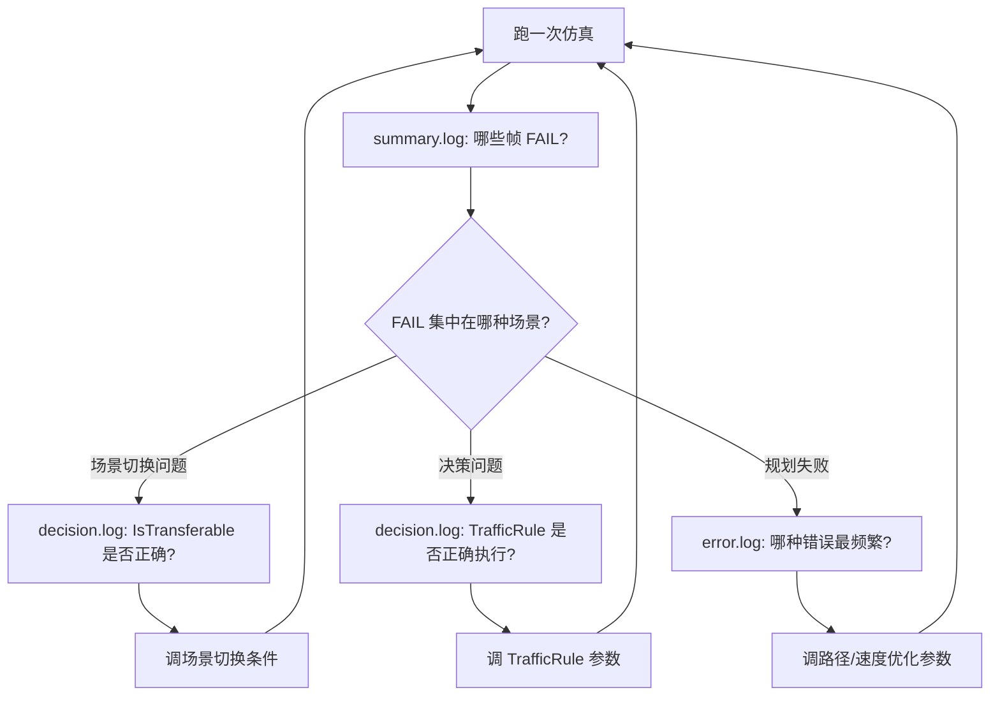

# Apollo PnC 新日志系统 (planlog)

> Phase 1+2 实施完成 | 2026-06-16
> 设计文档：`output/log_system_redesign.md`

---

## 一、改了什么

### 新建文件（6 个）

| 文件 | 用途 |
|------|------|
| `modules/planning/planning_base/common/planlog.h` | 7 个日志宏：`PFRAME_SUMMARY`、`PDECISION_LOG`、`PSTATE_LOG`、`PSCENARIO_INFO/WARN`、`PSTAGE_DEBUG`、`PLAN_LOG` |
| `modules/planning/planning_base/common/planlog_context.h/.cc` | `thread_local` 上下文：帧号、场景名、Stage 名 |
| `modules/planning/planning_base/common/planlog_sink.h/.cc` | 自定义 `google::LogSink`：JSON 序列化 + 按标签路由到不同文件 |
| `modules/planning/planning_base/common/planlog_init.cc` | `InitPlanningLogger()` / `ShutdownPlanningLogger()` |
| `scripts/clean_logs.sh` | 一键日志清理脚本（7 种策略） |
| `scripts/planlog.sh` | grep/awk 日志过滤工具（v0.1） |

### 修改文件（13 个）

| 文件 | 变更 |
|------|------|
| `planning_gflags.cc/.h` | 新增 5 个 gflags：`planning_log_json`、`planning_log_level`、`planning_log_dir`、`planning_log_per_scenario`、`planning_log_trace_rotate_minutes` |
| `planning_base/BUILD` | srcs/hdrs 列表添加 6 个新文件 |
| `planning_component.cc/.h` | `Init()` 末尾调用 `InitPlanningLogger()`，析构调用 `ShutdownPlanningLogger()` |
| `on_lane_planning.cc` | 帧开始设 `set_frame_seq`，帧结束写 `PFRAME_SUMMARY` |
| `scenario_manager.cc` | 场景切换时设 `set_scenario_name` + `PDECISION_LOG`（IsTransferable），Reset 写 `PSTATE_LOG` |
| `public_road_planner.cc` | `Plan()` 入口/出口写 `PSCENARIO_INFO`，Process 后设 `set_stage_name` |
| `traffic_decider.cc` | 每条 TrafficRule 执行后写 `PDECISION_LOG` |
| `stage.cc` | `ExecuteTaskOnReferenceLine` 开头设 `set_stage_name` + `PSTAGE_DEBUG` |
| `planning.conf` | 追加 5 行日志系统配置 |

### Bug 修复（2 个）— 始终生效，无需 `USE_NEW_LOG`

| 文件 | 问题 | 修复 |
|------|------|------|
| `scenarios/square/extricate_stage.cc:35` | `#define AINFO AERROR` 将所有 INFO 强制升级为 ERROR | 删除该宏 |
| `tasks/rss_decider/rss_decider.cc:346-347` | `is_rss_safe` 和 `cur_dist_lon` 重复打印 | 删除重复行 |

### 编译开关

所有新宏/调用包裹在 `#ifdef USE_NEW_LOG` / `#endif` 中。默认编译**不激活**，向后完全兼容。

激活方式：在 `.bazelrc` 中添加 `build --copt=-DUSE_NEW_LOG`，然后正常 `buildtool build -p core`。

---

## 二、怎么用

### 2.1 日志文件结构

```
data/log/planning/
├── summary.log      # 每帧一行 JSON（~300B/帧）
├── decision.log     # 决策 + 状态转换
├── error.log        # ERROR/WARN 独立归档
├── trace/           # 开发模式全量日志（需 planning_log_level=5）
└── per_scenario/    # 按场景分文件（需 planning_log_per_scenario=true）
```

### 2.2 配置文件（planning.conf）

```
--planning_log_json=true         # 启用 JSON 结构化输出
--planning_log_level=3           # 0=FATAL, 1=ERROR, 2=SUMMARY, 3=DECISION, 4=STATE, 5=TRACE
--planning_log_dir=data/log/planning
--planning_log_per_scenario=false
--planning_log_trace_rotate_minutes=10
```

### 2.3 日志宏速查

```cpp
// 帧摘要 — 每帧 1 行，写 summary.log
PFRAME_SUMMARY << "frame complete" << " speed=" << v << " status=" << ok;

// 决策日志 — 写 decision.log
PDECISION_LOG << "IsTransferable: " << from << " -> " << to << " = TRUE";
PDECISION_LOG << "traffic_rule[" << rule_name << "] = applied";

// 状态日志 — 写 decision.log
PSTATE_LOG << "SCENARIO_RESET: " << old << " -> " << new;

// 场景感知日志
PSCENARIO_INFO << "Plan() start";
PSCENARIO_WARN << "something wrong";
```

### 2.4 planlog.sh 过滤工具

```bash
# 按场景过滤
bash scripts/planlog.sh data/log/planning.INFO --scenario lane_follow

# 提取指定帧完整日志
bash scripts/planlog.sh data/log/planning.INFO --frame 12345

# 错误统计（按模式分组 + 首次/末次错误）
bash scripts/planlog.sh data/log/planning.INFO --errors

# 场景切换 ASCII 时间线
bash scripts/planlog.sh data/log/planning.INFO --timeline

# 帧边界 + 耗时
bash scripts/planlog.sh data/log/planning.INFO --frames

# 按级别过滤
bash scripts/planlog.sh data/log/planning.INFO --level ERROR,WARN

# 时间范围过滤
bash scripts/planlog.sh data/log/planning.INFO --from "09:00:00" --to "09:05:00"
```

### 2.5 clean_logs.sh 清理工具

```bash
# 预览（安全）
bash scripts/clean_logs.sh --dry-run

# 清理 3 天前
bash scripts/clean_logs.sh --days 3

# 只清理 planning 模块
bash scripts/clean_logs.sh --module planning

# Planning 专项清理（重建目录）
bash scripts/clean_logs.sh --planning

# 删除 >100MB 的日志
bash scripts/clean_logs.sh --size 100

# 每模块只保留最新文件
bash scripts/clean_logs.sh --keep-latest
```

### 2.6 激活/停用新日志

```bash
# 激活：在 .bazelrc 最后添加
build --copt=-DUSE_NEW_LOG

# 停用：注释掉 .bazelrc 中该行，或在编译时不带 .bazelrc
buildtool build -p core    # 默认不激活
```

---

## 三、如何利用新日志系统解赛题

### 核心思路：从"大海捞针"到"秒级定位"

**旧方式的问题**：planning.INFO 是 ~90MB 的纯文本，566 帧产生 ~270,000 行日志。找问题需要 `grep` 大海捞针。

**新方式的三步法**：

### Step 1：看 summary.log 快速定位问题帧

```bash
# 1 秒定位：哪些帧 FAIL 了？
grep '"status":"FAIL"' data/log/planning/summary.log

# 输出示例：
# {"frm":455, "scn":"LANE_FOLLOW", "speed":10.09, "plan_time_ms":35.65, "status":"FAIL"}
```

一眼看到：帧 455，场景 LANE_FOLLOW，速度 10m/s，规划耗时 35ms，失败。立刻知道是哪帧、什么场景下出的问题。

### Step 2：看 decision.log 理解决策链路

```bash
# 场景切换路径
grep "IsTransferable" data/log/planning/decision.log

# 每条 TrafficRule 的执行
grep "traffic_rule" data/log/planning/decision.log
```

**赛题场景分析示例**：

| 赛题 | 看什么 | 怎么用 |
|------|--------|--------|
| **借道绕行** | `IsTransferable: LANE_FOLLOW -> LANE_BORROW` | 检查何时触发借道场景，是否过早/过晚 |
| **人行道避让** | `traffic_rule[CROSSWALK] = applied` | 检查人行道规则是否生效、停止位置是否正确 |
| **红绿灯** | `traffic_rule[TRAFFIC_LIGHT] = applied` | 检查信号灯决策是否及时 |
| **停车标志** | `traffic_rule[STOP_SIGN] = applied` | 检查停止墙是否在正确位置 |
| **变道** | `traffic_rule[REROUTING] = applied` | 检查变道路由是否触发 |

### Step 3：看 error.log 查规划失败原因

```bash
# 错误频率统计
bash scripts/planlog.sh data/log/planning.INFO --errors
```

**输出示例**：
```
    168  failed optimization status: primal infeasible
    130  Speed fallback due to algorithm failure
    124  Fail to aggregate planning trajectory
     21  Failed to get reference line
```

立刻知道：**路径优化不可行**（primal infeasible）是第一大问题，其次是**速度 fallback**。针对性地调路径优化参数或检查参考线。

### 赛题调试工作流



### 实战技巧

1. **对比法**：跑两遍仿真（比如改参数前后），对比 summary.log 中的 `plan_time_ms` 和 `traj_pts`，立刻看到参数对规划质量的影响
2. **帧级回放**：`planlog.sh --frame 455` 提取该帧完整日志，从 InitFrame 到 Plan 结束，逐阶段分析
3. **时间线法**：`planlog.sh --timeline` 看场景切换时间线，定位震荡（频繁切换）
4. **错误溯源**：error.log 中的每行 JSON 都带 `frm`/`scn`/`stg`，直接关联到具体帧和场景

---

## 四、常见问题

**Q: 为什么 `scn`/`stg` 显示 "unknown"？**
A: `.bazelrc` 中的 `-DUSE_NEW_LOG` 是否生效？用 `grep USE_NEW_LOG .bazelrc` 检查。或者 scenario_manager/planner 的上下文设置代码是否被 formatter 破坏。

**Q: decision.log 为什么这么大（100MB+）？**
A: 旧日志 APPEND 模式残留。跑仿真前 `rm -f data/log/planning/*.log` 清理。

**Q: 提交评测平台会有影响吗？**
A: 不会。评测平台不会设置 `-DUSE_NEW_LOG`，所有新代码在 `#ifdef` 内不激活。两个 bug 修复始终生效（正面影响）。
