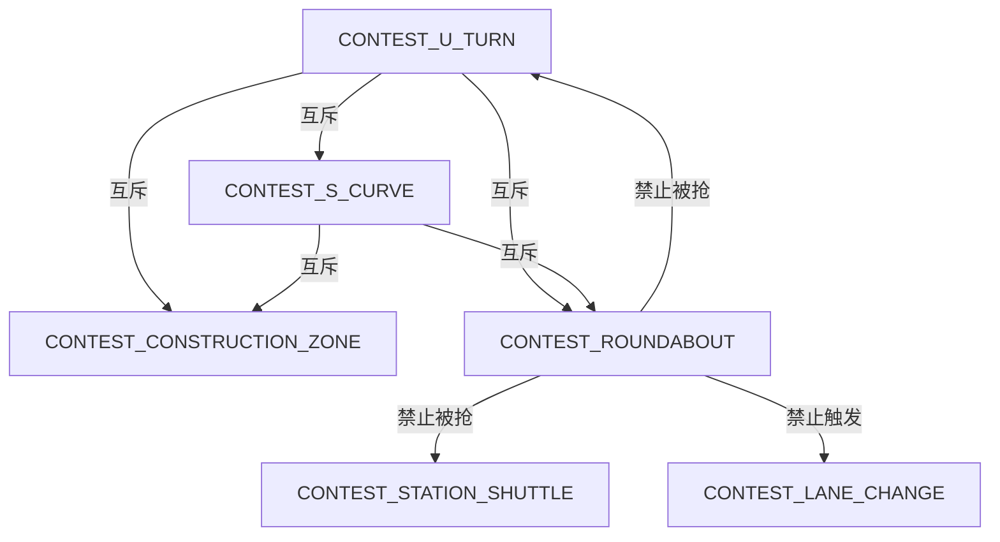
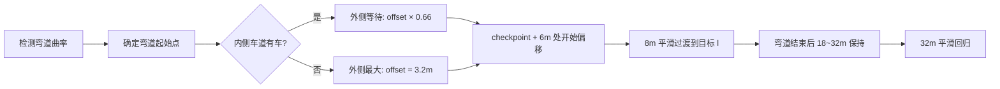

# 2026 百度 Apollo 星火自动驾驶大赛 PnC 赛道 — 技术分析报告

> 日期：2026-06-13  
> 项目：Apollo EDU PnC 赛事工程  
> 赛道：Planning & Control（PnC）

---

## 目录

1. [赛题总览](#一赛题总览)
2. [地图分析](#二地图分析)
3. [系统架构](#三系统架构)
4. [场景检测机制](#四场景检测机制)
5. [各赛题实现详解](#五各赛题实现详解)
   - 5.1 [赛题一：交通灯场景](#51-赛题一交通灯场景)
   - 5.2 [赛题二：变道场景](#52-赛题二变道场景)
   - 5.3 [赛题三：S 弯场景](#53-赛题三s-弯场景)
   - 5.4 [赛题四：U 型弯场景](#54-赛题四u-型弯场景)
   - 5.5 [赛题五：施工区域通行场景](#55-赛题五施工区域通行场景)
   - 5.6 [赛题六：站点接驳场景](#56-赛题六站点接驳场景)
   - 5.7 [赛题七：环岛让行场景](#57-赛题七环岛让行场景)
6. [路径规划策略](#六路径规划策略)
7. [速度决策与让行逻辑](#七速度决策与让行逻辑)
8. [配置参数总览](#八配置参数总览)
9. [关键创新与优化](#九关键创新与优化)

---

## 一、赛题总览

### 1.1 赛事背景

2026 星火自动驾驶大赛省级选拔赛使用百度 Apollo 10.0 平台，赛道聚焦 **PnC（Planning & Control）** 模块。选手需要在给定高精地图（`Xh_2026_contest`）上，通过 Apollo Studio 仿真平台完成全部 12 个场景的自动驾驶任务。

### 1.2 12 个场景一览

| 编号 | 场景名称 | 核心考点 | 障碍物 | 赛题分组 |
|------|----------|----------|--------|----------|
| 079 | xh_2026_S弯场景_1 | 连续弯道 + 锥桶绕行 | 14 锥桶 | 赛题三 |
| 07a | xh_2026_S弯场景_2 | 连续弯道 + 密集锥桶 | 24 锥桶 | 赛题三 |
| 07b | xh_2026_U形弯道场景_1 | U 型掉头 + 静态障碍物 | 1大货+2锥桶 | 赛题四 |
| 07c | xh_2026_U形弯道场景_2 | U 型掉头 + 静态障碍物 | 1大货+2锥桶 | 赛题四 |
| 07d | xh_2026_变道场景 | 自主变道 | 无 | 赛题二 |
| 07e | xh_2026_施工区域通行_1 | 锥桶绕行 | 36 锥桶 | 赛题五 |
| 07f | xh_2026_施工区域通行_2 | 锥桶绕行 | 36 锥桶 | 赛题五 |
| 080 | xh_2026_环岛让行场景_1 | 环岛让行 | 无静态 | 赛题七 |
| 081 | xh_2026_站点接驳场景_1 | 精准停靠 + 静止等待 | 2 大车 | 赛题六 |
| 082 | xh_2026_站点接驳场景_2 | 精准停靠 + 静止等待 | 2大车+1锥桶 | 赛题六 |
| 084 | xh_2026_红绿灯场景_1 | 信号灯通行 | 无 | 赛题一 |
| 084(2) | xh_2026_红绿灯场景_2 | 信号灯通行 | 无 | 赛题一 |

### 1.3 赛题分值分布（推测）

| 赛题 | 场景数 | 核心难度 | 预计分值占比 |
|------|--------|----------|------------|
| 赛题一：交通灯 | 2 | ⭐⭐ | 15% |
| 赛题二：变道 | 1 | ⭐⭐ | 10% |
| 赛题三：S 弯 | 2 | ⭐⭐⭐ | 15% |
| 赛题四：U 型弯 | 2 | ⭐⭐⭐⭐ | 20% |
| 赛题五：施工区域 | 2 | ⭐⭐⭐ | 15% |
| 赛题六：站点接驳 | 2 | ⭐⭐⭐ | 15% |
| 赛题七：环岛让行 | 1 | ⭐⭐⭐⭐ | 10% |

---

## 二、地图分析

### 2.1 地图基本信息

| 属性 | 数值 |
|------|------|
| 地图 ID | `69d51ffd0e41e1217f2fda19` |
| 地图名称 | Xh_2026_contest |
| 覆盖范围 | ~921m × 1258m（约 1.16 km²） |
| 车道总数 | 560（全部 CITY_DRIVING） |
| 路口数 | 9 |
| 信号灯 | 24 组（69 个子信号灯） |
| 人行横道 | 34 |
| 停止标志 | 1 |
| 减速带 | 6 |
| 泊车位 | 43（2 个集群） |

### 2.2 限速分布

| 限速值 | 车道数 | 占比 | 适用区域 |
|--------|--------|------|----------|
| 70 km/h (19.44 m/s) | 533 | 95.2% | 主路 |
| 10 km/h (2.78 m/s) | 27 | 4.8% | S 弯 / 环岛 / 站点等特殊区域 |

### 2.3 转向分布

| 转向类型 | 数量 | 占比 |
|----------|------|------|
| NO_TURN（直行） | 550 | 98.2% |
| LEFT_TURN（左转） | 8 | 1.4% |
| RIGHT_TURN（右转） | 0 | 0% |
| U_TURN（掉头） | 2 | 0.4% |

### 2.4 U-Turn 车道定位

| 车道 ID | 位置 | 长度 | 所在路口 |
|---------|------|------|----------|
| Lane_1559 | (423878, 4438239) | 14.2 m | Junction_6 |
| Lane_1583 | (423877, 4438454) | 13.7 m | Junction_7 |

### 2.5 关键路径推测

```
起点(423527,4438074) → S弯区域 → 站点B(423944,4438126) → U-Turn路口(J6/J7)
  → 环岛(J14, 423661,4437632) → 施工区域(423990,4437618) → 终点
```

### 2.6 地图质量警告

| 问题 | 严重度 | 影响 |
|------|--------|------|
| Lane_1759 宽度不足（0.66~0.97m） | ⚠️ | 可能被判定不可通行 |
| StopSign_1 无路口 Overlap 关联 | ⚠️ | 停车逻辑可能异常 |
| Subsignal 类型多为 UNKNOWN（66/69） | ℹ️ | 信号灯语义理解受限 |

---

## 三、系统架构

### 3.1 整体架构

本项目的 Planning 模块基于 Apollo Planning 2.0 架构，采用 **Scenario → Stage → Task** 三层调度模型：

```
┌──────────────────────────────────────────────────┐
│              PlanningComponent                    │
│  public_road_planner_config.pb.txt               │
│  (18 个 Scenario 按优先级排列)                     │
└──────────────────┬───────────────────────────────┘
                   │
    ┌──────────────▼──────────────────────────────┐
    │          Scenario Manager                    │
    │  遍历 Scenario 列表，调用 IsTransferable()    │
    │  自动切换到命中的场景                          │
    └──────────────┬──────────────────────────────┘
                   │
    ┌──────────────▼──────────────────────────────┐
    │          Contest Scenario (6 个)              │
    │  LANE_CHANGE / S_CURVE / U_TURN              │
    │  CONSTRUCTION_ZONE / STATION_SHUTTLE         │
    │  ROUNDABOUT                                   │
    │  (每个 Scenario 内部有一个 Stage)              │
    └──────────────┬──────────────────────────────┘
                   │
    ┌──────────────▼──────────────────────────────┐
    │    ContestLaneFollowStage (唯一 Stage)        │
    │  复用 LaneFollow 的 Task 流水线               │
    └──────────────┬──────────────────────────────┘
                   │
    ┌──────────────▼──────────────────────────────┐
    │              Task 流水线                       │
    │  ContestLaneChangePath                        │
    │  ContestLaneFollowPath                        │
    │  ContestLaneBorrowPath                        │
    │  FallbackPath → PathDecider                   │
    │  RuleBasedStopDecider → SpeedBoundsDecider     │
    │  PathTimeHeuristicOptimizer → SpeedDecider     │
    │  SpeedBoundsDecider → PiecewiseJerkSpeed       │
    └──────────────────────────────────────────────┘
```

### 3.2 Scenario 优先级与互斥关系

```
Scenario 优先级顺序（public_road_planner_config.pb.txt）:

EMERGENCY_PULL_OVER          ← 紧急靠边（最高优先级）
EMERGENCY_STOP
BUS_BAY_TRANSFER
BARE_INTERSECTION_UNPROTECTED
STOP_SIGN_UNPROTECTED
YIELD_SIGN
CONTEST_ROUNDABOUT           ← 赛事场景：环岛
CONTEST_CONSTRUCTION_ZONE    ← 赛事场景：施工区域
CONTEST_LANE_CHANGE          ← 赛事场景：变道
CONTEST_S_CURVE              ← 赛事场景：S弯
CONTEST_U_TURN               ← 赛事场景：U型弯
TRAFFIC_LIGHT_UNPROTECTED_LEFT_TURN
TRAFFIC_LIGHT_UNPROTECTED_RIGHT_TURN
TRAFFIC_LIGHT_PROTECTED
PULL_OVER
PARK_AND_GO
LANE_FOLLOW                  ← 默认场景（最低优先级）
```

**互斥关系**：



### 3.3 关键文件索引

| 文件 | 作用 |
|------|------|
| `modules/planning/scenarios/contest/contest_scenarios.h` | 6 个 Scenario 类定义 + 插件注册 |
| `modules/planning/scenarios/contest/contest_scenarios.cc` | Scenario 初始化、IsTransferable() 实现 |
| `modules/planning/scenarios/contest/contest_scenario_util.h` | 场景检测函数声明 |
| `modules/planning/scenarios/contest/contest_scenario_util.cc` | 场景检测函数实现（~500 行） |
| `modules/planning/scenarios/contest/context.h` | 上下文结构体 ContestScenarioContext |
| `modules/planning/scenarios/contest/stage_contest_lane_follow.h/cc` | 统一 Stage + StillInScenario() |
| `modules/planning/scenarios/contest/proto/contest.proto` | 配置 protobuf 定义 |
| `modules/planning/tasks/contest_lane_borrow_path/` | 借道路径生成（U 弯/施工区核心） |
| `modules/planning/tasks/contest_lane_follow_path/` | 车道保持路径生成（S 弯/变道/U 弯） |
| `modules/planning/tasks/contest_lane_change_path/` | 变道路径生成 |
| `modules/planning/planning_base/common/contest_scenario_features.h` | 特征检测工具函数 |

---

## 四、场景检测机制

### 4.1 检测流程总览

```
每帧 Planning 循环:

  1. ScenarioManager 按优先级遍历所有 Scenario
  2. 对每个 Scenario 调用 IsTransferable(other_scenario, frame)
  3. 命中后调用 Enter(frame) → Stage::Process()
  4. 每帧调用 StillInScenario(frame)
  5. 返回 false → Exit() → FinishScenario()
```

### 4.2 六种场景检测算法

#### 变道场景（CONTEST_LANE_CHANGE）

**检测条件**：`planning_command->has_lane_follow_command()` 且 `reference_line_info().size() > 1`

- 最简单：reference_line_info 数量 > 1 即表示参考线包含变道指令

**退出条件**：不再有多条 reference_line

---

#### S 弯场景（CONTEST_S_CURVE）

**检测条件**（两步判定）：

1. **曲率检测**：前方 90m 内 `max_abs_kappa > 0.015`
2. **锥桶计数**：前方 90m 内至少有 4 个小型障碍物（锥桶），且锥桶中心 |l| < 3.5m

**退出条件**：不再满足上述条件，或被 U 弯场景抢走

```cpp
// 核心判断
if (max_abs_kappa < 0.015) return false;
if (small_obstacle_count >= 4 && |obstacle_center_l| < 3.5) return true;
```

---

#### U 型弯场景（CONTEST_U_TURN）— 最复杂的检测

**检测条件**（方法 A + 方法 B 双保险）：

| 方法 | 原理 | 阈值 |
|------|------|------|
| **方法 A**：Lane Turn 属性 | 遍历参考线前方 35m 的 lane segments，检查 `turn == U_TURN` | 命中即返回 true |
| **方法 B**：原始几何 heading | 读取路由中每条 lane 的中心曲线点，计算单向 net heading change | `net_h > 2.0 rad` 且 `ratio > 0.5` |

**方法 B 核心逻辑**：

```cpp
// 对每个 lane segment 的 central_curve 逐点计算 heading 变化
double sum_abs_dh = 0.0;   // 累计绝对 heading 变化
double net_h = ...;        // 净 heading 变化
double ratio = net_h / sum_abs_dh;  // 单向性比率

if (net_h > 2.0 rad && ratio > 0.5) return true;  // U 弯
// 若 ratio < 0.5: S 弯（左右方向抵消），排除误判
```

**设计要点**：
- 不依赖参考线平滑（平滑会稀释 heading 变化）
- 直接使用 lane 中心曲线的原始几何数据
- 单向性比率 `ratio` 用于区分 U 弯 (≈1.0) 和 S 弯 (≈0.06)

**退出条件**：`|current_heading - entry_heading| > 2.7 rad` 且车辆回到车道中心 (±0.8m) 且到达终点附近

---

#### 施工区域场景（CONTEST_CONSTRUCTION_ZONE）

**检测条件**：

| 步骤 | 内容 | 阈值 |
|------|------|------|
| 1 | 排除 U 弯和 S 弯 | — |
| 2 | 跨所有参考线统计锥桶数量 | ≥ 20 个 |
| 3 | 锥桶在车前方 100m 内，横向 ±12m | — |

**退出条件**：前方锥桶数量归零，或被 U 弯/S 弯场景抢走

---

#### 站点接驳场景（CONTEST_STATION_SHUTTLE）

**检测条件**：
- 前方 80m 内存在 parking_space overlap（泊车位）
- 尚未驶离（`shuttle_departed == false`）

**生命周期**：

```
进入 → 驶向泊车位 → 到达（速度<0.1m/s，距离<1.5m）
  → 停靠 5s（dwell timer）→ 驶离（shuttle_departed=true）→ 退出
```

---

#### 环岛场景（CONTEST_ROUNDABOUT）— 多层级检测

**检测条件**（4 层判定）：

| 层级 | 检测内容 | 阈值 |
|------|----------|------|
| ① 排除 U 弯 | `HasNearUTurnFeature()` | kappa>0.08 且 heading_change>2.2 |
| ② PNC 路口近场 | 前方 80m 内是否有 pnc_junction_overlap | 需在激活窗口内（距离≤18m） |
| ③ 短距离曲率 | 前方 55m 内 max_abs_kappa + heading_change | kappa>0.025, 0.65<Δh<1.8 rad |
| ④ 长距离几何（备用） | 前方 180m 内 | kappa>0.018, 0.75<Δh<2.2 rad |

**退出条件**：
- commit 后按 XY 距离退出（70m）
- 未 commit 时按几何范围退出（离开 PNC junction 附近）

**防重入机制**：退出后记录 exit_xy，距离出口 < 100m 时禁止重入

---

## 五、各赛题实现详解

### 5.1 赛题一：交通灯场景

**考点**：红绿灯识别与响应

**实现方案**：
- Apollo 内置 `TRAFFIC_LIGHT_PROTECTED` / `TRAFFIC_LIGHT_UNPROTECTED_RIGHT_TURN` 场景
- 通过 Traffic Rule `traffic_light` 处理红灯停车、绿灯通行逻辑
- 无需额外的 Contest 代码

**关键 Traffic Rule**：`modules/planning/traffic_rules/traffic_light/`

---

### 5.2 赛题二：变道场景

**考点**：自主变道决策与执行

**实现方案**：
- Scenario: `CONTEST_LANE_CHANGE`
- 检测：`reference_line_info().size() > 1`（路由中存在变道指令）
- Task: `ContestLaneChangePath` — 生成变道路径
- 特殊处理：变道 reference_line 上跳过 lane_follow 和 lane_borrow，避免覆盖

**路径生成策略**：
- `ContestLaneFollowPath` 中检测附近动态车辆
- 若有车辆紧贴 → 保持当前车道（`should_stay=true`，收窄边界到 ±0.5m）
- 若无车辆紧贴 → 扩展边界（±4.0m），允许大范围变道

---

### 5.3 赛题三：S 弯场景

**考点**：连续弯道 + 锥桶绕行

**实现方案**：
- Scenario: `CONTEST_S_CURVE`
- 检测：高曲率 (>0.015) + 锥桶 (>4 个)

**路径策略**：
- `ContestLaneFollowPath`：锥桶密集区域使用 **Nudge 边界** 作为路径参考（`UpdateDenseConeSCurvePathRef`）
  - 当路径点被障碍物 Nudge 时，目标 `l` 设为中心
  - 使用高参考权重（`path_reference_l_weight`）固定路径
- `ContestLaneBorrowPath`：必要时借道绕行

---

### 5.4 赛题四：U 型弯场景 ⭐ 核心难点

**考点**：13m 内完成 180° 掉头 + 避开大货车/锥桶障碍物

**问题诊断**：

```
车辆 NEOLIX 最小转弯半径 2.5m → 最大曲率 0.40 rad/m
Lane_1955 参考线曲率 0.24 rad/m → 物理上可行，但路径规划层出问题

根因：
① ContestLaneBorrowPath 在 U 弯场景直接跳过 → 只用 ContestLaneFollowPath
② ContestLaneFollowPath 强制 path_reference_l_weight=10000
   → 路径被死死拉向 l=0 的参考线
   → 13m 内急转 180°，优化器无法同时满足高 weight + 曲率约束
   → 路径振荡、发散、不可行 → 车辆原地转圈
```

**解决方案**（3 层优化）：

```
第 1 层：U 弯宽走廊路径（ContestLaneBorrowPath）
  ├── 左右边界同时扩展到全路宽（±3.0m）
  ├── l_weight = 0.5（温和），path_reference_l_weight = 5.0
  ├── retry：若失败则回退到 l_weight=0（完全松弛）
  └── 使用 corridor 中点而非 lane 中心作为参考

第 2 层：大半径转弯参考（BuildUTurnLargeRadiusReference）
  ├── 检测弯道曲率起始点
  ├── 在弯道处将目标 l 推向弯道外侧（大半径侧）
  ├── 内侧车道有车？→ 外侧等待模式（delta_l × 0.66）
  └── 通过后平滑回归

第 3 层：障碍物处理
  ├── 忽略静态障碍物（IgnoreStaticObstaclesForUTurn）
  ├── 内侧车道车辆让行逻辑（CheckUTurnInnerLaneTraffic）
  └── 后方逼近风险检测（HasUTurnInnerLaneRearApproachRisk）
```

**速度策略**：U 弯区域限速 5 m/s（via `AddUTurnSpeedLimit`）

**退出保护**：
- heading 反转 ≥ 155°（2.7 rad）
- 车辆 l 回到 ±0.8m 以内
- 到达终点 8m 范围内
- 最大额外保持 50 帧

---

### 5.5 赛题五：施工区域通行场景

**考点**：密集锥桶阵列绕行（36 个锥桶横跨三车道）

**实现方案**：
- Scenario: `CONTEST_CONSTRUCTION_ZONE`
- Task: `ContestLaneBorrowPath`（借道绕行）

**核心策略**：
1. **跨车道锥桶计数**：不限于当前参考线的锥桶，跨所有参考线统计
2. **车辆坐标系定位**：使用 XY 坐标 + heading 判断锥桶前后/左右位置，避免多参考线 SL 不一致
3. **强制借道模式**：检测到锥桶即开启借道，防止 `UpdateSelfPathInfo` 错误切换回 SELF-LANE
4. **零拉力路径**：`l_weight = 0.0, path_reference_l_weight = 0.0`，让路径自由跟随可行通道中心
5. **紧贴锥桶检测**：`HasCloseConstructionConeAhead()` — 前方 6m 内、横向 2.4m 内检测紧贴锥桶
6. **倒车恢复**：锥桶过于密集无法直行通过时，支持倒车重新寻找路径

**边界生成**：`ContestLaneBorrowPath::ForceConstructionLaneBorrow()`
- 借道方向：优先选择锥桶少的一侧
- 边界扩展：借道侧扩展到邻车道

---

### 5.6 赛题六：站点接驳场景

**考点**：精准停靠泊车位 + 静止等待 5 秒 + 安全驶离

**实现方案**：
- Scenario: `CONTEST_STATION_SHUTTLE`
- Stage: `ContestLaneFollowStage::InjectStationShuttleStop()`

**生命周期状态机**：

```
┌──────────────┐    到达泊车位前    ┌─────────────────┐
│  APPROACH    │─────────────────▶│  ARRIVED_AT      │
│  注入 STOP   │  speed<0.1m/s    │  _STATION        │
│  fence       │  dist<1.5m       │  保持 STOP fence │
└──────────────┘                  └────────┬─────────┘
                                           │ dwell 5s
                                           ▼
                                  ┌─────────────────┐
                                  │  DEPARTED        │
                                  │  清除 STOP fence │
                                  │  场景退出         │
                                  └─────────────────┘
```

**关键实现细节**：
- 通过 `map_path().parking_space_overlaps()` 查找前方最近泊车位
- 在泊车前 0.5m 处注入 stop fence
- 区域限速：8.33 m/s（30 km/h）

---

### 5.7 赛题七：环岛让行场景 ⭐ 核心难点

**考点**：环岛让行规则（避让环岛内车辆）

**问题分析**：

```
环岛结构：
  ┌──────────────────────────────────┐
  │        密集车流 (BatchRoute1)     │
  │        10m 间距, 10m/s 速度       │
  │        逆时针绕行                 │
  │                    ADC 入口       │
  │                    (南侧)         │
  └──────────────────────────────────┘

核心挑战：BatchRoute1 间距仅 10m (1s)，留给 ADC 的切入间隙极小
```

**检测算法**：4 层判定（详见第 4.2 节）

**环岛让行核心逻辑**（`SpeedDecider`）：

```
1. IsRoundaboutNonTargetLaneVehicle()
   ├── 查找障碍物所在 lane（通过 HDMap::GetNearestLaneWithHeading）
   ├── 获取 ADC 当前所在 lane 列表
   ├── 障碍物 lane ≠ ADC lane → 忽略（不让行）
   └── 障碍物 lane = ADC lane → 正常处理

2. 紧窄窗口模式（IsTightContestWindowArea）
   ├── 环岛和 U 弯共享此模式
   └── 特殊的停止距离覆盖

3. 虚拟停止墙识别（IsRoundaboutStopWallLike）
   ├── PNC_JUNCTION_* / YS_* / SS_* / KC_JC_* / PATH_END_*
   └── 停止距离 = 0.6m
```

**退出机制**：
- 已提交（committed）：行驶 70m XY 距离后退出
- 未提交：离开几何范围后退出
- 防重入：出口 100m 内禁止再次切入

---

## 六、路径规划策略

### 6.1 路径生成流水线

```
PathBoundsDeciderUtil::InitPathBoundary()
  └→ PathBoundsDeciderUtil::GetBoundaryFromSelfLane()
      └→ ApplyContestLaneChangeBoundaryOverride()  // 变道边界
      └→ ApplyContestUTurnBoundaryExpansion()      // U弯扩展
      └→ ApplyDenseConeSCurveBoundaryTuning()      // S弯Nudge

  → OptimizePath()
      └→ ApplyContestLaneFollowPathReference()      // 参考线设置
          ├── U弯: corridor midpoint, weight=0
          ├── S弯: nudge boundary, weight=high
          └── 高曲率: jerk_relax = 2.5x
```

### 6.2 路径规划三任务对比

| 任务 | 适用场景 | l_weight | ref_weight | 路径类型 |
|------|----------|----------|------------|----------|
| ContestLaneFollowPath | S 弯、变道、普通 | 3.0 | 10000 | 紧贴参考线 |
| ContestLaneBorrowPath（普通） | 施工区域 | 0.0 | 0.0 | 自由通道 |
| ContestLaneBorrowPath（U 弯） | U 型弯 | 0.5→0.0 | 5.0→2.0 | 宽走廊大半径 |

### 6.3 U 弯大半径转弯参考（BuildUTurnLargeRadiusReference）



**关键参数**：

| 参数 | 值 | 含义 |
|------|-----|------|
| kOuterLaneOffset | 3.2m | 外侧偏移量 |
| kStandbyOffsetRatio | 0.66 | 等待模式偏移比例 |
| kShiftAfterCurveStartDistance | 8.0m | 偏移过渡距离 |
| kOuterHoldDistance | 18.0m | 弯道后保持距离 |
| kBlockedOuterHoldDistance | 32.0m | 阻塞时保持距离 |
| kReturnDistance | 32.0m | 回归距离 |

---

## 七、速度决策与让行逻辑

### 7.1 速度决策流水线

```
RuleBasedStopDecider
  └→ 检测停止标志/让行标志/人行横道
  └→ 环岛虚拟停止墙识别

SpeedBoundsDecider（先验）
  └→ 基于道路几何的速度边界

PathTimeHeuristicOptimizer
  └→ ST 图搜索初始速度曲线

SpeedDecider
  └→ 障碍物决策（STOP/YIELD/OVERTAKE/FOLLOW）
  └→ 环岛非目标车道车辆忽略
  └→ U 弯/环岛紧窄窗口模式

SpeedBoundsDecider（后验）
  └→ 最终速度边界

PiecewiseJerkSpeedOptimizer
  └→ 平滑速度曲线优化
```

### 7.2 环岛让行逻辑详解

```
SpeedDecider::Process():
  for each obstacle:
    if (环岛场景 && IsRoundaboutNonTargetLaneVehicle(obstacle, ref_line)):
      → AppendIgnoreDecision()  // 不处理
      continue
    
    if (紧窄窗口模式 && stop_distance < 0):
      → stop_distance = 虚拟墙距离 (0.6m)
    
    // 正常 STOP/YIELD/FOLLOW 决策
```

### 7.3 U 弯内侧车道让行

```
CheckUTurnInnerLaneTraffic():
  inner_lane = ±1.8m (内车道半宽)
  前方 70m 扫描动态车辆:
    ├── 车道内车辆在前面 → blocking
    └── 车道内车辆在后方已通过 → passed

HasUTurnInnerLaneRearApproachRisk():
  后方 20m 扫描:
    ├── 后间隙 < 8m → risk!
    └── 接近速度 > 1m/s → risk!
```

---

## 八、配置参数总览

### 8.1 ScenarioContestConfig (contest.proto)

```protobuf
// ── 施工区域 ──
construction_min_x: 423990.0      // ROI 最小 X
construction_max_x: 424210.0      // ROI 最大 X
construction_min_y: 4437580.0     // ROI 最小 Y
construction_max_y: 4437650.0     // ROI 最大 Y
construction_min_cone_count: 20   // 最少锥桶数
construction_look_forward_distance: 100.0  // 前视距离

// ── S 弯 ──
s_curve_min_cone_count: 4
s_curve_min_abs_kappa: 0.015
s_curve_look_forward_distance: 90.0
s_curve_max_obstacle_abs_l: 3.5

// ── U 型弯 ──
u_turn_look_forward_distance: 35.0     // 前视距离
u_turn_kappa_threshold: 0.12           // 曲率阈值
u_turn_heading_change_threshold: 2.0   // heading 变化阈值 (rad)

// ── 站点接驳 ──
station_shuttle_look_forward_distance: 80.0
station_shuttle_dwell_time_sec: 5.0    // 停靠时间
station_shuttle_speed_limit: 8.33      // 限速 (m/s, ≈30km/h)

// ── 环岛 ──
roundabout_entry_look_forward_distance: 80.0
roundabout_inside_junction_buffer: 25.0
roundabout_curve_look_forward_distance: 55.0
roundabout_min_abs_kappa: 0.025
roundabout_min_heading_change: 0.65    // rad (37°)
roundabout_max_heading_change: 1.80    // rad (103°)
```

### 8.2 运行时配置 (scenario_conf.pb.txt)

```
// 实际运行时覆盖的配置值：
u_turn_look_forward_distance: 60.0     // (proto default: 35.0)
u_turn_heading_change_threshold: 2.7   // (proto default: 2.0)
// 其他配置与 proto 默认值一致
```

### 8.3 U 弯关键硬编码常量

| 常量 | 值 | 位置 |
|------|-----|------|
| U 弯完成 heading 阈值 | 2.7 rad | stage_contest_lane_follow.cc |
| U 弯速度限制 | 5.0 m/s | contest_lane_borrow_path.cc |
| 宽走廊扩展 | ±3.0 m | contest_lane_follow_path_helper.cc |
| 单向性比率阈值 | 0.5 | contest_scenario_util.cc |
| 退出最大横向偏移 | 0.8 m | stage_contest_lane_follow.cc |

---

## 九、关键创新与优化

### 9.1 U 型弯场景

1. **双方法检测**：方法 A（Lane Turn 属性）+ 方法 B（原始几何 heading）双保险，解决地图 `turn` 字段标注不完整的问题
2. **单向性比率**：通过 `net_heading / sum_abs_heading` 区分 U 弯 (>0.6) 和 S 弯 (<0.1)，消除 S 弯误判
3. **宽走廊 + 温和拉力**：放弃传统 lane_follow 的强拉力 (weight=10000)，使用 corridor 中点 + 低权重 (5.0) 的温和约束，让优化器在宽边界内自由寻找平滑曲线
4. **大半径转弯参考**：将目标 l 推向弯道外侧（大半径侧），降低实际转弯曲率
5. **内侧车道让行**：检测内侧车道动态车辆，支持外侧等待/释放模式
6. **退出保护**：heading 反转后不立即退出，等待车辆回到车道中心

### 9.2 环岛场景

1. **4 层渐进式检测**：从快速排除（U 弯）→ PNC 路口近场 → 短距离曲率 → 长距离几何，层层递进
2. **非目标车道车辆忽略**：通过 HD Map 查询障碍物所在 lane，仅对同 lane 车辆执行让行决策
3. **紧窄窗口模式共享**：环岛和 U 弯共享速度决策策略
4. **防重入机制**：出口 100m 范围内禁止再次切入，避免反复振荡

### 9.3 施工区域场景

1. **跨车道锥桶统计**：不限于当前参考线，跨所有参考线统计锥桶，避免漏计
2. **车辆坐标系定位**：使用 XY 坐标 + heading 判断锥桶相对位置，避免多参考线 SL 不一致
3. **倒车恢复**：锥桶过于密集时支持倒车重新寻找路径
4. **强制借道防振荡**：防止 `UpdateSelfPathInfo` 错误切换回 SELF-LANE 导致的振荡

### 9.4 S 弯场景

1. **锥桶 Nudge 边界参考**：将障碍物 Nudge 边界作为路径参考中点，利用路径优化器自动避开锥桶
2. **曲率自适应 jerk 松弛**：高曲率区域将 jerk 约束放宽 2.5 倍

### 9.5 系统级优化

1. **变道 reference_line 保护**：变道场景中跳过 lane_follow 和 lane_borrow，避免路径互相覆盖
2. **U 弯 latch 过渡**：场景退出后提供一帧过渡保护（`u_turn_construct_` latch）
3. **场景互斥优先级**：U 弯 > S 弯 > 施工区域，环岛不与 U 弯/站点接驳冲突
4. **日志可观测性**：每个场景关键节点输出 `[UTURN]`、`[ROUNDABOUT]`、`[SS]`、`[CONSTRUCT]` 等带标签的结构化日志

---

## 附录 A：完整文件修改清单

| 文件 | 修改类型 | 涉及功能 |
|------|----------|----------|
| `contest_scenarios.h` | 新增 | 6 个 Scenario 类定义 |
| `contest_scenarios.cc` | 新增 | 所有 IsTransferable() 实现 + 环岛防重入 |
| `contest_scenario_util.h` | 新增 | 10 个检测函数声明 |
| `contest_scenario_util.cc` | 新增 | ~500 行检测算法实现 |
| `context.h` | 新增 | ContestScenarioContext 状态定义 |
| `stage_contest_lane_follow.h/cc` | 新增 | 统一 Stage + StillInScenario + 站点接驳注入 |
| `contest.proto` | 新增 | 22 个可配置参数 |
| `contest_lane_borrow_path.h/cc` | 修改 | U 弯宽走廊 + 施工区借道 + 大半径参考 |
| `contest_lane_follow_path.h/cc` | 修改 | S 弯 Nudge 参考 + U 弯边界扩展 + 变道边界 |
| `contest_lane_follow_path_helper.h/cc` | 新增 | 路径参考/边界辅助函数 |
| `contest_lane_change_path` | 参考 | 变道路径生成 |
| `contest_scenario_features.h` | 新增 | 特征检测工具 + 默认配置常量 |
| `contest_scenario_status.h` | 新增 | 场景状态查询 |
| `construction_zone_helper.h/cc` | 新增 | 施工区域辅助 |
| `u_turn_cone_nudge_helper.h/cc` | 新增 | U 弯锥桶 Nudge |
| `reverse_recovery_helper.h/cc` | 新增 | 倒车恢复 |
| `public_road_planner_config.pb.txt` | 修改 | 新增 6 个 Contest Scenario |
| `speed_decider.cc` | 修改 | 环岛/U 弯速度决策集成 |

## 附录 B：参考资料

- 地图分析：`MAP_ANALYSIS_REPORT.md`
- 环岛分析：`ROUNDABOUT_ANALYSIS_REPORT.md`
- U 弯分析：`U_TURN_ANALYSIS_REPORT.md`
- 场景开发指南：`docs/apollo_scenario_development_and_switching.md`
- Apollo EDU 知识库：`.claude/apollo-knowledge/`

---

> **注意**：本报告基于现有代码和已有分析报告编写。部分配置参数在运行时可能被 `scenario_conf.pb.txt` 覆盖，请以 profile 配置中的实际值为准。
