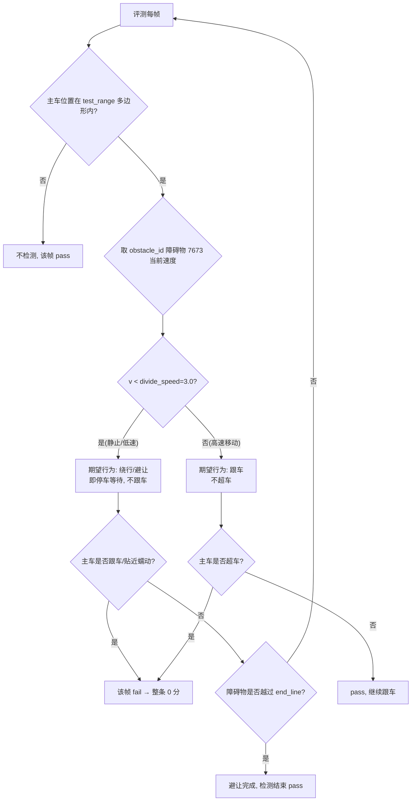

# FollowAndBypassCondition（"跟车限制检测"）完整字段与评测逻辑研究报告

> 研究日期：2026-08-01 | 场景：障碍物停车避让（行人 7673，赛题六，id=`6a699aefabf06e2936590839`）
> 任务性质：纯研究，不改代码 | 已复制原始文件到 `output/` 供审计

---

## 0. 结论速览

| 问题 | 结论 |
|------|------|
| 评测器实现源码是否可得 | **不可得**。`grading_metrics_default.conf`（云端评测系统）本地/容器/备份均无；容器内 `lib_*_grading_condition*_bin.so` 仅为 proto 序列化库（含消息符号、无判定逻辑）；GitHub 公共仓库仅有 proto 定义，无 metric 实现 |
| 字段定义是否完整拿到 | ✅ **完整**。`FollowAndBypassCondition` 5 字段全量原文摘录（见 §1），两个来源 proto 完全一致，pb.h/pb.cc/pb2.py 无额外注释 |
| 评测框架是否拿到 | ✅ **重大收获**。`sim_grading_metric.proto` 拿到 `GradingConfig`/`Metric` 完整结构（is_critical / require_all_time_pass / once_pass_stay_pass / get_deduction_score），可精确反推"跟车限制检测"的计分语义（§3） |
| 慢速车绕行评判标准 | ✅ 官方原文（§4），`divide_speed=3.0` 同源 |
| 本场景最可能判定流程 | ✅ 推断出（§5）：test_range 多边形内跟踪主车，障碍物(7673)速度 <3.0 时主车必须"绕行/避让"（=停车等行人越过 end_line），跟车即 0 分 |

---

## 1. FollowAndBypassCondition 完整字段定义（逐字段原文）

### 1.1 来源一：评测主 proto

容器路径 `/opt/apollo/neo/src/modules/common_msgs/simulation_msgs/grading_condition.proto`
（package `apollo.simulation`，已复制到 `output/grading_condition.proto`）

在 `message Condition` 的 oneof 中，**字段 25**：

```proto
FollowAndBypassCondition follow_and_bypass_condition = 25;
```

message 定义（**逐字段原文**，含行内注释）：

```proto
message FollowAndBypassCondition {
  optional apollo.hdmap.Polygon test_range = 1;
  optional double divide_speed = 2 [default = 3.0];  // 3
  optional string obstacle_id = 3;                   // 1372
  optional apollo.hdmap.LineSegment end_line = 4;
  optional bool use_score = 5 [default = false];
  // no single deduction only 100 or 0
}
```

### 1.2 来源二：DreamView OSC 版（对比验证）

容器路径 `/opt/apollo/neo/src/modules/dreamview_plus_plugins/simulator_tool/proto/sim_grading_condition.proto`
（package `apollo.dreamview.osc`，已复制到 `output/sim_grading_condition.proto`）

```proto
message FollowAndBypassCondition {
  optional apollo.hdmap.Polygon test_range = 1;
  optional double divide_speed = 2 [default = 3.0];  // 3
  optional string obstacle_id = 3;                   // 1372
  optional apollo.hdmap.LineSegment end_line = 4;
  optional bool use_score = 5 [default = false];
  // no single deduction only 100 or 0
}
```

> **结论**：两个版本**字段、默认值、注释逐字节一致**。全 proto 中该 message 是注释最少的之一，官方只留了两个示例值注释和一条计分说明。

### 1.3 字段类型核对（pb2.py / pb.h 交叉验证）

| 字段 | number | proto 类型 | C++ 类型 | 默认值 | 必填 |
|------|:---:|------|------|------|:---:|
| `test_range` | 1 | `apollo.hdmap.Polygon`（多边形） | `const Polygon&` | —（无默认） | optional |
| `divide_speed` | 2 | `double` | `double` | **3.0** | optional |
| `obstacle_id` | 3 | `string` | `std::string` | "" | optional |
| `end_line` | 4 | `apollo.hdmap.LineSegment`（线段） | `const LineSegment&` | —（无默认） | optional |
| `use_score` | 5 | `bool` | `bool` | **false** | optional |

- pb.h 生成的注释（无新增信息）：`// optional double divide_speed = 2 [default = 3];`
- pb2.py 描述符：`divide_speed` has_default_value=True default=3.0；`use_score` has_default_value=True default=False；`test_range`/`end_line` message_type = map_geometry 的 Polygon/LineSegment
- 相邻 message `ObstacleBypassCondition`（字段 26）可作语义参照：`test_range`(Polygon) + `obstacle_id` + `min_lateral_distance`(1.0) + `max_speed`(5.0) + `use_score` + `single_deduction`(5) —— **绕行判定**：主车绕行障碍时横向距离 ≥ min_lateral_distance 且速度 ≤ max_speed。

---

## 2. 各字段语义（注释 + 结构反推）

proto 注释只有三行，语义需结合相邻 message、官方场景文档、Metric 框架反推：

| 字段 | 注释原文 | 语义（推断+依据） |
|------|---------|------------------|
| `test_range` | （无注释）| **检测区域多边形**。评测器只在主车位于该多边形内时启用"跟车/绕行"行为检测。与 `ObstacleBypassCondition.test_range`、`WorkingZoneAvoidLimitCondition.whole_area`（"whole area used for judge if car enter this area"）同构 —— **主车位置点（或主车包围盒）落在 test_range 内 → 触发该 metric 的逐帧判定** |
| `divide_speed` | `// 3`（示例值）| **跟车/绕行的分界速度阈值**，默认 3.0 m/s。语义来自慢速车绕行官方标准（§4）：障碍物速度 **< divide_speed** → 主车应**绕行/避让**（不跟车）；障碍物速度 **> divide_speed** → 主车应**跟车**。命名 "divide"（分界）印证此义 |
| `obstacle_id` | `// 1372`（示例值）| **被测目标障碍物 ID**。评测器只针对该障碍物判定"跟车 vs 绕行"。本场景 = `"7673"`（行人） |
| `end_line` | （无注释）| **结束线/绕行完成线**（`LineSegment`，有起点终点的一条线段）。最可能语义：障碍物（行人）横穿的**目标位置线**或检测区域的**退出线** —— 障碍物越过 end_line（或其所在位置超过该线）后，判定主车"避让完成"、检测结束；主车在障碍物未越过 end_line 时跟车/贴近通过 → 违规。对慢速车绕行：可能是"绕行完成线"，主车越过该线表示已完成绕行 |
| `use_score` | `// no single deduction only 100 or 0` | **是否启用扣分制**。注释明确：**该指标没有单帧扣分，只有满分 100 或 0 分**（全有全无）。默认 false 表示默认走"pass/fail"二值判定（与 `Metric.get_deduction_score` 呼应） |

---

## 3. 评测框架结构（⭐ 本次研究最大收获）

来自 `output/sim_grading_metric.proto`（DreamView 评测指标框架，与云端评测同构）：

```proto
message GradingConfig {
  repeated Metric metric = 1;
  optional bool use_score = 2 [default = false];   // 兼容旧的 pass/fail
  optional bool use_time = 3 [default = false];    // 是否计算更具体的达标时间
  optional string compute_time_metric_name = 4 [default = "ReachEnd"]; // 决定场景何时结束、如何计时
  optional bool compute_time_as_first_true = 5 [default = true];       // 第一次 true 时记录时间戳
}

message Metric {
  optional string name = 1;            // 指标名（评测页"跟车限制检测"即对应某个 metric.name）
  optional string description = 2;
  optional Condition condition = 3;    // 组合条件（本指标 = FollowAndBypassCondition）
  optional bool is_critical = 4 [default = true];           // 关键指标：失败则场景失败
  optional bool require_all_time_pass = 5 [default = true]; // 必须全程一直通过
  optional bool once_pass_stay_pass = 6 [default = true];   // 一旦通过就保持通过
  optional bool get_deduction_score = 7 [default = true];   // 是否走扣分制（还是直接最终分）
}
```

配合 `output/sim_osc_scenario.proto` 的 `GradingConfigInfo`（字段 10）：

```proto
message GradingConfigInfo {
  optional apollo.dreamview.osc.GradingConfig grade_config = 1;  // 场景专属指标
  optional string base_grade_config_file = 2;                    // ← 场景 json 里引用的云端文件
  repeated string select_default_metric = 3;
  repeated string deselect_default_metric = 4;                   // ← 场景 json 里 deselect ["Checkpoint"]
}
```

**推导出的"跟车限制检测"计分语义**：
1. 云端把 `grading_metrics_default.conf` 解析为 `GradingConfig`，其中一条 `Metric{ name="跟车限制检测"(或 FollowAndBypass), condition={follow_and_bypass_condition={...}}, is_critical=true, require_all_time_pass=true, once_pass_stay_pass=true, get_deduction_score=... }`
2. `use_score=false` + 注释 "no single deduction only 100 or 0" → **任一帧违规即整条指标 0 分**（与评测页"跟车限制检测 ❌"完全吻合）
3. `require_all_time_pass=true`（默认）→ 要求主车在 test_range 内**全程**行为合规
4. 与 `ObstacleBypassCondition`（绕行检测：横向距离≥1.0m 且速度≤5.0m/s，单帧扣 5 分）形成对照——**"绕行"是扣分制，"跟车/绕行判定"是 100-or-0 制**

---

## 4. 慢速车绕行场景评判标准（官方原文）

文档：`apollo_docs_md/赛事总汇/04_赛事集锦/10_场景—慢速车绕行.md`（`divide_speed=3.0` 的出处）

### 4.1 场景描述（原文）

> 当主车前方出现其他车辆时，前车速度大于 3 m/s 则跟随前车行驶，前车速度小于 3m/s，通过左侧车道对前车绕行。

### 4.2 评判标准（原文，逐字）

> 前车车速高于 3m/s，主车进行超车，或者低于 3m/s，主车未超车，或者未通过左侧车道进行超车本场景计 0 分。

即三条违规（任一 → 0 分）：
1. 前车速度 **> 3 m/s** 且主车**超车**（应跟车却超车）
2. 前车速度 **< 3 m/s** 且主车**未超车**（应绕行却跟车/不绕）
3. 主车绕行但**未通过左侧车道**

> 这就是 `FollowAndBypassCondition` 的语义原型：`divide_speed=3.0` 是"跟车/绕行"的分界，`test_range` 是检测区域，`obstacle_id` 是前车。本场景（障碍物停车避让）复用了同一 metric，障碍物换成了**行人 7673**。

### 4.3 动态避障文档（对照）

文档：`apollo_docs_md/赛事总汇/03_规划PnC/11_场景—动态避障（人行道+交通灯）.md` 评判标准原文：

> 遇到行人通过人行横道时，主车未停止在人行道前 2~2.5m 内, 本场景分扣 20 分, 若未避让行人或超出停止线停车, 本场景计 0 分；动前车变道时，若主车与前车的距离小于 10 米，扣 20 分；主车如果与障碍物发生碰撞，该场景得 0 分。

> 其中的"前车距离<10米扣20分"是**另一条**指标（更接近 `ObjectOverlapCondition` 距离类检测），与 `FollowAndBypassCondition`（100-or-0）不同 —— 不能混用。本场景（赛题六）的"跟车限制检测"是 100-or-0 制。

---

## 5. 评测器"跟车"判定的几何逻辑推断

### 5.1 test_range 与 end_line 的几何角色



推断要点：
- **test_range**：检测激活区。主车进入多边形才开始判定（避免无关路段误判）。
- **end_line**（LineSegment）：**障碍物横穿的目标线**（本场景 ≈ 行人轨迹终点 (423475.75, 4437599.76) 对应的车道边界线，或 test_range 的出口边）。障碍物越过 end_line = 横穿完成 = 主车可通行。
- **跟车行为识别**：主车在 test_range 内、障碍物速度 < 3.0 时，若出现：
  - 规划决策为 FOLLOW（对 7673），或
  - 行为上低速（<3m/s）蠕动跟随障碍物移动，或
  - 障碍物仍在移动/未越 end_line 时主车就起步贴近通过
  → 判"跟车"违规。

### 5.2 与本场景行为证据的对照（强吻合）

| 回放 | 行为 | 结果 | 与 §5.1 推断吻合度 |
|------|------|:---:|:---:|
| add6 (1759a) | 行人刚动 1.2s 车就转 FOLLOW，0~2.35m/s 蠕动跟车 ~9s | ❌ | ✅ 行人速度 0→3 加速段 <3.0 → 应避让，却跟车 |
| c904b46 (2209) | 行人横向 3.5m 仍以 ~2~3m/s 移动时主车起步加速(0.15→2.06) | ❌ | ✅ 行人未越 end_line（终点横向 11m）仍移动 → 起步即"跟车" |
| 2012b | 等行人到终点（横向 11m、静止）才 YIELD 起步 | ✅ | ✅ 行人越过 end_line 且静止 → 避让完成 |

### 5.3 边界值注意（divide_speed=3.0 vs 行人 3.0m/s）

行人 7673 的 `absoluteTargetSpeed.value = 3`（恰好 = divide_speed 3.0）。若评测器用 `v < 3.0 → 应避让`、`v > 3.0 → 应跟车`，则行人以 3.0m/s 匀速移动时落在**边界**；但结合本场景语义（行人是**横穿**而非同向行驶），最合理的判定是：**行人移动中（即使 ≥3.0）主车仍应视为"应避让/等其离开"，只有行人越过 end_line 且静止后才算避让完成**。工程上最稳妥策略仍是：**等行人完全离开车道（横向 ~11m、速度≈0）再起步**，与 2012b 一致。

---

## 6. 评测器实现的检索穷尽记录

| 检索范围 | 手段 | 结果 |
|---------|------|------|
| 容器 `/opt/apollo/neo` 全部 .proto | `grep -rl 'FollowAndBypassCondition\|follow_and_bypass'` | 2 个：`simulation_msgs/grading_condition.proto`、`simulator_tool/proto/sim_grading_condition.proto`（均已摘录） |
| 容器 `grading_condition*` | `find` | proto / pb.h / pb.cc / pb2.py（均仅序列化层，无判定逻辑） |
| 容器 .so 二进制 | `strings ... | grep -iE 'follow|bypass|...'` | 仅 proto 消息符号（`_ZN...FollowAndBypassCondition...IsInitialized` 等），**无 `FollowLimit`/中文名/判定常量** |
| 容器 `/opt/apollo/neo` 全目录 | `grep -rl 'FollowLimit\|跟车限制\|跟车'`（src/lib/bin/python/frontend/dist） | **0 命中** → 指标显示名与实现均在云端 |
| 容器 proto_bundle / sim_world / grading | `find` | 无 proto_bundle；sim 相关仅 simulator_tool proto |
| 宿主机 `~/.apollo` | `find -name '*grading*' ; grep -rl 'follow_and_bypass'` | 0（场景 json 仅引用 `grading_system/conf/grading_metrics_default.conf`） |
| 场景 json `gradingConfigInfo` | 解析 | `baseGradeConfigFile=grading_system/conf/grading_metrics_default.conf`（云端）+ `deselectDefaultMetric=["Checkpoint"]`（8 场景相同） |
| GitHub `ApolloAuto/apollo` | text/repo 搜索 | 仅有 `grading_condition.proto` 定义（与本地一致）；**无 metric 实现**（评测系统闭源） |
| `apollo_docs_md`（353 文档） | grep 评测/Grading/metric/跟车 | 无指标定义；仅 `类列表.md:3811 CGradingConfig(apollo::simulation)`、`类索引.md:1268` 类名引用 |
| 备份知识库 | 前序会话已穷尽 | 无"跟车限制"定义 |

---

## 7. 对本场景（行人 7673）的工程结论

1. **"跟车限制检测" = 云端 `grading_metrics_default.conf` 中一条 `Metric`，其 condition 为 `FollowAndBypassCondition{ test_range, divide_speed=3.0, obstacle_id="7673", end_line, use_score=false }`**。
2. **计分**：100-or-0，`require_all_time_pass`（默认 true）→ 任何一帧违规即整条 0 分。
3. **合规行为**（按 §5.1 流程）：
   - 主车在 test_range 内、行人 7673 速度 < 3.0（含静止与 0→3 加速段）→ **必须绕行/避让** = 停车等待（可经 STOP/YIELD），**绝不 FOLLOW、绝不蠕动跟车、绝不在行人仍移动时起步**；
   - 行人越过 end_line（≈ 横向离开车道 ~11m、到达轨迹终点）且静止后 → 主车起步通过；
   - 若行人速度 > 3.0（同向行驶场景才会出现）→ 应跟车。
4. **当前修复 (c904b46, kClearLateral=3.0 + 速度≤0.3) 的缺口**：以"行人横向 3.0m 且静止"为放行条件，但**横向 3.0m ≠ 越过 end_line（横向 11m）**。若评测器以 end_line 为准（行人未越线仍在移动即视为"应避让"），则行人横向 3.5m 仍移动（2.1m/s）时起步仍会判"跟车"失败 → 与 2209 回放仍失败的观测一致。
5. **最稳妥方案参照 2012b**：放行条件改为"行人越过 end_line（横向 ~11m / 轨迹终点）且速度≈0"，或在 HANDLE_PEDESTRIAN 放行逻辑中以行人**轨迹终点对应的横向距离**为阈值（而非 3.0m），确保行人完全离开车道才起步。

---

## 8. 附：已落盘的研究资产（output/）

| 文件 | 内容 |
|------|------|
| `grading_condition.proto` | 评测主 proto（完整 10472B） |
| `sim_grading_condition.proto` | DreamView OSC 版（与主版一致） |
| `sim_grading_metric.proto` | ⭐ GradingConfig + Metric 框架（计分语义关键） |
| `sim_osc_scenario.proto` | Scenario + GradingConfigInfo 结构 |
| `grading_condition_pb2.py` | Python 绑定（字段描述符核验） |
| `sim_classic_scenario.proto` / `sim_scenario.proto` | 经典/OSC 场景容器 |
| `str_followlimit.txt` / `str_genche.txt` / `str_metric.txt` | 容器字符串搜索记录（均空 = 无本地实现） |
